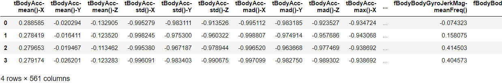
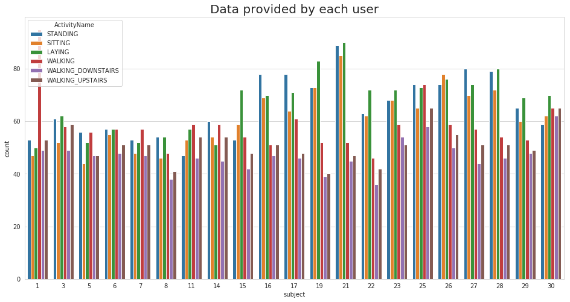
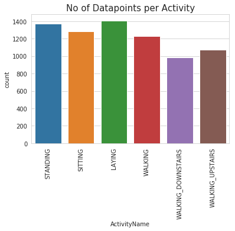
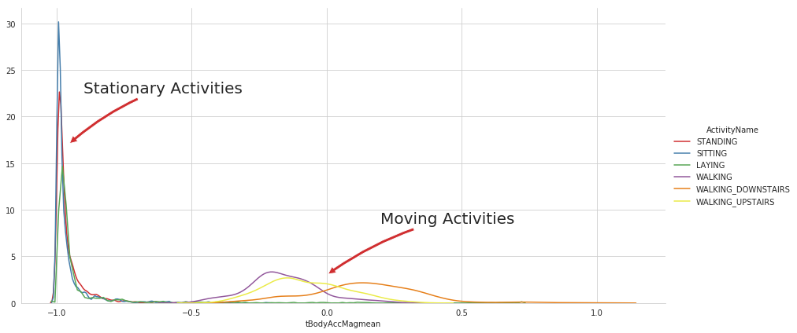
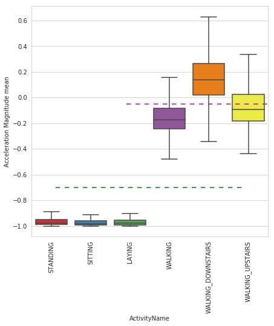
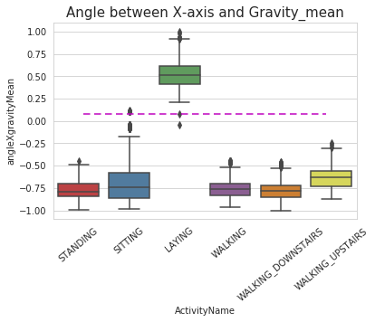
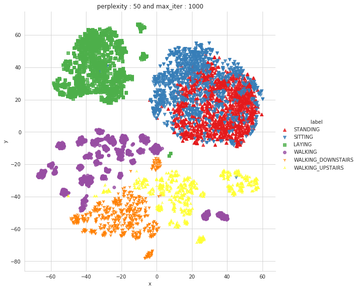
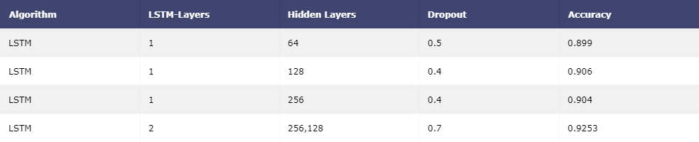
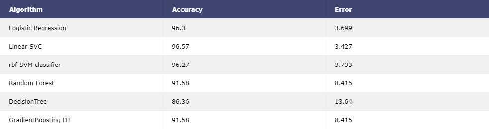

The project is to build a model that predicts the human activities such as Walking, Walking_Upstairs, Walking_Downstairs, Sitting, Standing or Laying.

This dataset is collected from 30 persons(referred as subjects in this dataset), performing different activities with a smartphone to their waists. The data is recorded with the help of sensors (accelerometer and Gyroscope) in that smartphone. This experiment was video recorded to label the data manually.

## How data was recorded
By using the sensors(Gyroscope and accelerometer) in a smartphone, they have captured '3-axial linear acceleration'(tAcc-XYZ) from accelerometer and '3-axial angular velocity' (tGyro-XYZ) from Gyroscope with several variations.

prefix 't' in those metrics denotes time.

suffix 'XYZ' represents 3-axial signals in X , Y, and Z directions.

## Feature names
These sensor signals are preprocessed by applying noise filters and then sampled in fixed-width windows(sliding windows) of 2.56 seconds each with 50% overlap. ie., each window has 128 readings. From Each window, a feature vector was obtianed by calculating variables from the time and frequency domain.

In our dataset, each datapoint represents a window with different readings

The accelertion signal was saperated into Body and Gravity acceleration signals(tBodyAcc-XYZ and tGravityAcc-XYZ) using some low pass filter with corner frequecy of 0.3Hz.After that, the body linear acceleration and angular velocity were derived in time to obtian jerk signals (tBodyAccJerk-XYZ and tBodyGyroJerk-XYZ).The magnitude of these 3-dimensional signals were calculated using the Euclidian norm. This magnitudes are represented as features with names like tBodyAccMag, tGravityAccMag, tBodyAccJerkMag, tBodyGyroMag and tBodyGyroJerkMag.

Finally, We've got frequency domain signals from some of the available signals by applying a FFT (Fast Fourier Transform). These signals obtained were labeled with prefix 'f' just like original signals with prefix 't'. These signals are labeled as fBodyAcc-XYZ, fBodyGyroMag etc.,.

## Y_Labels(Encoded)
In the dataset, Y_labels are represented as numbers from 1 to 6 as their identifiers.

* WALKING as 1
* WALKING_UPSTAIRS as 2
* WALKING_DOWNSTAIRS as 3
* SITTING as 4
* STANDING as 5
* LAYING as 6

These are the signals that we got so far.

* tBodyAcc-XYZ
* tGravityAcc-XYZ
* tBodyAccJerk-XYZ
* tBodyGyro-XYZ
* tBodyGyroJerk-XYZ
* tBodyAccMag
* tGravityAccMag
* tBodyAccJerkMag
* tBodyGyroMag
* tBodyGyroJerkMag
* fBodyAcc-XYZ
* fBodyAccJerk-XYZ
* fBodyGyro-XYZ
* fBodyAccMag
* fBodyAccJerkMag
* fBodyGyroMag
* fBodyGyroJerkMag

We can esitmate some set of variables from the above signals. ie., We will estimate the following properties on each and every signal that we recoreded so far.
* mean(): Mean value
* std(): Standard deviation
* mad(): Median absolute deviation
* max(): Largest value in array
* min(): Smallest value in array
* sma(): Signal magnitude area
* energy(): Energy measure. Sum of the squares divided by the number of values.
* iqr(): Interquartile range
* entropy(): Signal entropy
* arCoeff(): Autorregresion coefficients with Burg order equal to 4
* correlation(): correlation coefficient between two signals
* maxInds(): index of the frequency component with largest magnitude
* meanFreq(): Weighted average of the frequency components to obtain a mean frequency
* skewness(): skewness of the frequency domain signal
* kurtosis(): kurtosis of the frequency domain signal
* bandsEnergy(): Energy of a frequency interval within the 64 bins of the FFT of each window.
* angle(): Angle between to vectors.

## Data Overview

Accelerometer and Gyroscope readings are taken from 30 volunteers(referred as subjects) while performing the following 6 Activities.
Readings are divided into a window of 2.56 seconds with 50% overlapping. Accelerometer readings are divided into gravity acceleration and body acceleration readings, which has x,y and z components each. Gyroscope readings are the measure of angular velocities which has x,y and z components. Jerk signals are calculated for BodyAcceleration readings.Fourier Transforms are made on the above time readings to obtain frequency readings.

Now, on all the base signal readings., mean, max, mad, sma, arcoefficient, engerybands,entropy etc., are calculated for each window.
We get a feature vector of 561 features and these features are given in the dataset.Each window of readings is a datapoint of 561 features.

  

## Exploratory Data analysis

1. The data is collected from 30 persons.

  

2. We can see that the data is well balanced.

  

3. The stationary and moving activities are completely different

  

4. Magnitude of Acceleration 

* If tAccMean is < -0.8 then the Activities are either Standing or Sitting or Laying.
* If tAccMean is > -0.6 then the Activities are either Walking or WalkingDownstairs or WalkingUpstairs.
* If tAccMean > 0.0 then the Activity is WalkingDownstairs.
* We can classify 75% the Acitivity labels with some errors.

  

5. GravityAccelerationComponents

* If angleX,gravityMean > 0 then Activity is Laying.
* We can classify all datapoints belonging to Laying activity with just a single if else statement.

  

6. TSNE Visualization

Sitting and standing activities are overlapping while the other classes are sperable.

  

## Machine Learning Models

### 1. Logistic Regression

We also know that LR works well with high dimension data. So we applied the training data to the model and used the CV data for finding best hyper-parameter (lambda). We get an accuracy of 96.3.

### 2. rbf SVM classifier

Kernel SVM classifier can learn complex functions and it tries to maximize the probability of correct class. we apply the training data to the model and used the CV data for finding best hyper-parameter (lambda). We get an accuracy of 96.3.

### 4. Random Forest

DT works well with low-dimension data.It is also interpretable. By changing the no of base learners and max depth in Random Forest Classifier we found that best base learners=130 and max depth=7.Then we fitted the model with best hyper-parameters and test data is applied to it and found out that accuracy is 91.7

### 5. XGBoost

Xgboost performs very well on large data and are also interpretable. They outperform other linear model. With n_estimators as 160, max_depth of 5 we get an accuracy of 90.4.

### 6. LSTM

Since Deep Learning can extract features on own , we try LSTM model on 9 raw features and try various architectures and hyperparameter tune to get better accuracy. We get an accuracy of 92.5.

## Results

**LSTM Models**

  

**Machine Learning Models**

  

